# MediTrack — Clinic & Appointment Management System

A console-based Clinic & Appointment Management System built in Core Java
for the Airtribe Backend Java Track (Module 7 project). It models
patients, doctors, appointments, and billing for a single clinic, entirely
in-memory — no database, no external APIs. See
[`docs/Design_Decisions.md`](docs/Design_Decisions.md) for the reasoning
behind the package layout, assumptions made, and how each grading
criterion maps onto the code; [`docs/JVM_Report.md`](docs/JVM_Report.md)
for how the JVM actually runs it; and
[`docs/Setup_Instructions.md`](docs/Setup_Instructions.md) to get a JDK
installed.

## Features

**Core**
- **Patient & Doctor management** — register patients and doctors;
  search by id, name, age (patients) or id, name, specialization
  (doctors)
- **Appointments** — book, cancel, and list appointments, tracked through
  an `AppointmentStatus` lifecycle (`PENDING` → `CONFIRMED` → `CANCELLED`
  / `COMPLETED`); every booking/cancellation fires a console reminder via
  the Observer pattern, plus a background `TimerTask` reminder
- **Billing** — generate a `ConsultationBill` or `ProcedureBill` (each
  taxes the base fee differently), then summarize it into an immutable
  `BillSummary`, optionally applying a billing strategy (standard /
  insurance coverage)
- **Analytics** — average doctor consultation fee, appointment count per
  doctor, doctor count per specialization (all via the Stream API)
- **Manual test suite** — `TestRunner` (no JUnit) covers registration,
  search, deep cloning, booking/cancellation, billing tax math, both
  singleton variants, validation failures, and two concurrency scenarios

See [`docs/Design_Decisions.md`](docs/Design_Decisions.md) for the full
list of what each of the 100 grading points maps to in code.

## Design Patterns Used

| Pattern   | Where                                                        | Why |
|-----------|---------------------------------------------------------------|-----|
| Singleton (eager) | `util.IdGenerator`                                     | One shared, thread-safe id sequence per entity type across the whole app |
| Singleton (lazy)  | `util.AppConfig`                                       | App-wide config, built only on first use, via double-checked locking |
| Factory   | `service.BillFactory`                                        | Single place that maps a `BillType` to the right `Bill` subclass |
| Observer  | `service.AppointmentObserver` + `AppointmentService`         | Notify any number of channels (console today; email/SMS could implement the same interface) when an appointment is booked or cancelled |
| Strategy  | `service.BillingStrategy` + `StandardBillingStrategy` / `InsuranceBillingStrategy` | Swap how a bill's total is discounted without `BillingService` branching on payer type |

## Package Structure

```
com.airtribe.meditrack
├── Main                 Menu-driven console entry point
├── constants  Constants
├── entity     MedicalEntity (abstract), Person (abstract), Doctor,
│              Patient (Cloneable), Specialization, AppointmentStatus,
│              Appointment (Cloneable), Bill (abstract), ConsultationBill,
│              ProcedureBill, BillSummary (immutable)
├── service    DoctorService, PatientService, AppointmentService,
│              BillingService, BillFactory, AppointmentObserver,
│              ConsoleReminderObserver, BillingStrategy,
│              StandardBillingStrategy, InsuranceBillingStrategy
├── util       Validator, DateUtil, CSVUtil, IdGenerator, AppConfig,
│              DataStore<T>
├── exception  AppointmentNotFoundException, InvalidDataException
├── interfaces Searchable<T>, Payable
└── test       TestRunner (manual tests, no JUnit)
```

> The brief's expected tree names this package `interface/`, but that's a
> reserved Java keyword and won't compile — see
> [`docs/Design_Decisions.md`](docs/Design_Decisions.md) for this and
> every other deliberate deviation from the brief's skeleton.

## Class Diagram

```mermaid
classDiagram
    class MedicalEntity {
        <<abstract>>
        #String id
        #LocalDateTime createdAt
        +describe()* String
    }
    class Person {
        <<abstract>>
        #String name
        #int age
        #String contactNumber
    }
    class Doctor {
        -Specialization specialization
        -double consultationFee
    }
    class Patient {
        -List~String~ medicalHistory
        +clone() Patient
        +addHistoryEntry(String) void
    }
    class Appointment {
        -Patient patient
        -Doctor doctor
        -LocalDateTime scheduledAt
        -AppointmentStatus status
        +confirm() void
        +cancel() void
        +complete() void
        +clone() Appointment
    }
    class Bill {
        <<abstract>>
        #Appointment appointment
        #double baseAmount
        #boolean paid
        +calculateTotal()* double
    }
    class ConsultationBill
    class ProcedureBill {
        -double procedureCost
    }
    class BillSummary {
        <<immutable>>
        -String billId
        -String patientName
        -double totalAmount
        -LocalDateTime generatedAt
    }
    class Payable {
        <<interface>>
        +calculateTotal() double
        +printReceipt() void
    }
    class Searchable~T~ {
        <<interface>>
        +search(String) List~T~
        +exists(String) boolean
    }
    class DataStore~T~ {
        -Map~String,T~ store
        +save(T) void
        +findById(String) Optional~T~
        +findAll() List~T~
        +deleteById(String) boolean
    }
    class IdGenerator {
        <<singleton-eager>>
        -static IdGenerator INSTANCE
        -AtomicInteger patientSeq
        +static getInstance() IdGenerator
    }
    class AppConfig {
        <<singleton-lazy>>
        -static volatile AppConfig instance
        +static getInstance() AppConfig
    }
    class BillFactory {
        <<factory>>
        +static createBill(BillType, Appointment, double) Bill
    }
    class AppointmentObserver {
        <<interface>>
        +onAppointmentCreated(Appointment) void
        +onAppointmentCancelled(Appointment) void
    }
    class ConsoleReminderObserver
    class BillingStrategy {
        <<interface>>
        +applyDiscount(double) double
    }
    class StandardBillingStrategy
    class InsuranceBillingStrategy
    class DoctorService {
        +registerDoctor(...) Doctor
        +findBySpecialization(Specialization) List~Doctor~
        +averageFee() double
    }
    class PatientService {
        +registerPatient(...) Patient
        +searchPatient(String) Patient
        +searchPatient(String, boolean) List~Patient~
        +searchPatient(int) List~Patient~
    }
    class AppointmentService {
        -List~AppointmentObserver~ observers
        -Timer reminderTimer
        +bookAppointment(...) Appointment
        +cancelAppointment(String) Appointment
        +appointmentsPerDoctor() Map~String,Long~
    }
    class BillingService {
        +generateBill(Appointment) Bill
        +summarize(Bill, BillingStrategy) BillSummary
    }
    class Main {
        +static main(String[]) void
    }

    MedicalEntity <|-- Person
    MedicalEntity <|-- Appointment
    MedicalEntity <|-- Bill
    Person <|-- Doctor
    Person <|-- Patient
    Bill <|-- ConsultationBill
    Bill <|-- ProcedureBill
    Bill ..|> Payable
    Appointment "1" --> "1" Patient
    Appointment "1" --> "1" Doctor
    Bill "1" --> "1" Appointment
    DoctorService ..|> Searchable
    PatientService ..|> Searchable
    DoctorService --> DataStore
    PatientService --> DataStore
    AppointmentService --> DataStore
    BillingService --> DataStore
    AppointmentService --> AppointmentObserver : notifies
    ConsoleReminderObserver ..|> AppointmentObserver
    BillingService --> BillFactory : uses
    BillingService --> BillingStrategy : uses
    StandardBillingStrategy ..|> BillingStrategy
    InsuranceBillingStrategy ..|> BillingStrategy
    BillingService --> BillSummary : creates
    DoctorService --> IdGenerator
    PatientService --> IdGenerator
    AppointmentService --> IdGenerator
    Main --> AppConfig
    Main --> DoctorService
    Main --> PatientService
    Main --> AppointmentService
    Main --> BillingService
```



## How to Compile and Run

Requires a JDK (17 recommended — see
[`docs/Setup_Instructions.md`](docs/Setup_Instructions.md)). All source
lives under `src/main/java`, rooted at the `com.airtribe.meditrack`
package.

### From the terminal

From the project root:

```bash
# Compile
javac -d out $(find src/main/java -name "*.java")

# On Windows PowerShell, use instead:
# Get-ChildItem -Recurse -Filter *.java src/main/java | ForEach-Object { $_.FullName } | Out-File sources.txt -Encoding ascii
# javac -d out "@sources.txt"

# Run the app
java -cp out com.airtribe.meditrack.Main

# Run just the manual test suite
java -cp out com.airtribe.meditrack.test.TestRunner
```

### From an IDE (IntelliJ IDEA / Eclipse / VS Code)

1. Open the project root folder as a new project.
2. Mark `src/main/java` as a **Sources Root** (IntelliJ) or ensure it's
   on the build path (Eclipse/VS Code).
3. Run `com.airtribe.meditrack.Main`.

## Sample Output

Running `TestRunner` (menu option 9, or standalone):

```
[PASS] registerPatient stores the patient
[PASS] searchPatient(name) overload finds it
[PASS] searchPatient(age) overload finds it
[PASS] clone() returns a distinct object
[PASS] clone() deep-copies medicalHistory (original unaffected)
[PASS] booked appointment is CONFIRMED
[PASS] cancelled appointment is CANCELLED
[PASS] consultation bill total includes tax (> base fee)
[AppConfig] static block: MediTrack class metadata loading...
[PASS] AppConfig (lazy singleton) always returns the same instance
[PASS] IdGenerator (eager singleton) always returns the same instance
[PASS] registerPatient rejects invalid data
[PASS] concurrent IdGenerator calls produce 20 unique ids
[PASS] concurrent synchronized DataStore writes are all retained

Results: 13 passed, 0 failed
```

Running `Main` — registering a patient and a doctor, booking an
appointment, and generating a bill:

```
Welcome to MediTrack v1.0.0
[Reminder] New appointment booked: Appointment[APT0001] Asha Rao with Vivek Iyer at ... - CONFIRMED

==== MediTrack Menu ====
...
Choose an option: 1
Name: Rahul Mehta
Age: 29
Contact (10 digits): 9812345678
Registered: Patient Rahul Mehta [PAT0002], age 29, contact 9812345678

Choose an option: 2
Name: Anita Desai
Age: 38
Contact (10 digits): 9800011122
Specializations: [CARDIOLOGY, DERMATOLOGY, GENERAL_MEDICINE, PEDIATRICS, ORTHOPEDICS, NEUROLOGY, ENT]
Specialization: ORTHOPEDICS
Consultation fee: 650
Registered: Dr. Anita Desai [DOC0002] - ORTHOPEDICS - Fee: 650.00

Choose an option: 3
Patient ID: PAT0002
Doctor ID: DOC0002
Hours from now: 24
[Reminder] New appointment booked: Appointment[APT0002] Rahul Mehta with Anita Desai at ... - CONFIRMED
Booked: Appointment[APT0002] Rahul Mehta with Anita Desai at ... - CONFIRMED

Choose an option: 6
Appointment ID: APT0002
BillSummary[BIL0001] Rahul Mehta owes 682.50 (generated ...)

Choose an option: 0
Goodbye!
```

(650 consultation fee × 1.05 standard tax rate = 682.50, matching
`ConsultationBill.calculateTotal()`.)
